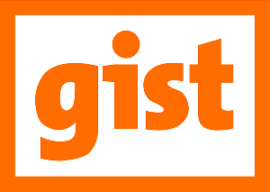

# gist
gist is Semantic Arts' minimalist upper ontology for the enterprise. It is designed to have the maximum coverage of typical business ontology concepts with the fewest number of primitives and the least amount of ambiguity. 

We have an active governance and best practices community around gist called the gist Council, with a teleconference on the first Thursday of every month, where practitioners and users of gist come together to discuss how to use gist and make suggestions on its evolution.  Please send email to GistCouncil@semanticarts.com if you would like to become involved.

You can also contribute to gist by adding your comments to [issue discussion threads](https://github.com/semanticarts/gist/issues) and submitting new issues and pull requests. You can view [minutes](https://github.com/semanticarts/gist/wiki/gist-Issue-Review-Meetings) from our biweekly issue review sessions to find out what we've been reviewing and get a preview of upcoming changes to gist.

gist is free and open to the public under the [Creative Commons 3.0](http://creativecommons.org/licenses/by-sa/3.0/) attribution share-alike license. For more information on gist or to download previously released versions of gist, see our [website](https://www.semanticarts.com/gist).
